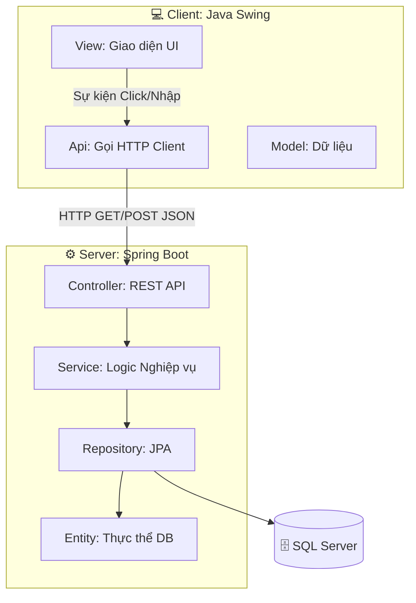
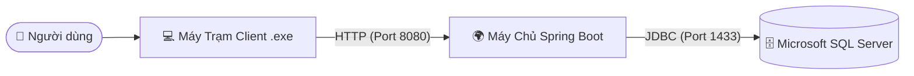

# 🎓 BÁO CÁO DỰ ÁN: HỆ THỐNG QUẢN LÝ HỌC SINH (QLHS_SpringBoot)

Dự án này là hệ thống phần mềm quản lý trường học được xây dựng theo mô hình phân tán Client - Server, sử dụng Java Swing và Spring Boot. Dưới đây là phân tích chi tiết về kiến trúc dự án dựa trên mã nguồn.

---

## 📖 CHƯƠNG 1: GIỚI THIỆU VÀ PHÂN TÍCH VẤN ĐỀ

### 🎯 1.1. Mô tả bài toán
Hệ thống **Quản lý học sinh** được xây dựng nhằm giải quyết nhu cầu tin học hóa các nghiệp vụ quản lý trong trường học. Hệ thống giúp nhà trường và giáo viên quản lý hiệu quả thông tin đa chiều bao gồm: học sinh (`HocSinh`), giáo viên (`GiaoVien`), lớp học (`Lop`), bộ môn (`ToBoMon`), thời khóa biểu (`TKB`), điểm số (`Diem`), lịch thi (`LichThi`), phòng học (`PhongHoc`), hạnh kiểm (`HanhKiem`), học phí (`Hocphi`), đối tượng ưu tiên (`DoiTuongUuTien`), phúc khảo (`Phuckhao`) và hệ thống thông báo (`Thongbao`).

### 🚀 1.2. Mục tiêu kiến trúc
- **Yêu cầu chức năng**: Cung cấp giao diện trực quan cho phép người dùng (với các quyền khác nhau thông qua bảng `TaiKhoan`) thao tác CRUD (Thêm, Sửa, Xóa, Đọc) dữ liệu nhà trường.
- **Yêu cầu phi chức năng**:
  - *Khả năng mở rộng*: Hệ thống cần tách biệt giữa Frontend và Backend để dễ dàng nâng cấp, thêm ứng dụng Web/Mobile trong tương lai mà không ảnh hưởng tới lõi nghiệp vụ.
  - *Tính độc lập (Decoupling)*: Tách biệt hoàn toàn giữa giao diện người dùng (Client) và xử lý nghiệp vụ, dữ liệu (Server).

### 🌐 1.3. Phạm vi hệ thống
Hệ thống chia làm 2 ứng dụng hoạt động song song:
- 🖥️ **QuanLyHocSinh_Client**: Ứng dụng Desktop (Desktop App) đóng vai trò là giao diện tương tác với người dùng.
- ⚙️ **QuanLyHocSinh_Server**: Máy chủ API đóng vai trò xử lý logic nghiệp vụ trung tâm và thao tác với Database.

---

## 🏗️ CHƯƠNG 2: LỰA CHỌN KIỂU KIẾN TRÚC (ARCHITECTURAL STYLES)
Dự án áp dụng và kết hợp các kiểu kiến trúc sau:
- 🔗 **Kiểu Client/Server (Phân tán)**: Hệ thống được tách biệt rạch ròi. `QuanLyHocSinh_Client` sẽ giao tiếp với `QuanLyHocSinh_Server` thông qua các lệnh gọi RESTful API (HTTP Requests) thay vì Client truy cập trực tiếp vào cơ sở dữ liệu.
- 🥞 **Kiểu Phân tầng (Layered/N-tier Architecture)**: 
  - Tại hệ thống Server (Spring Boot), mã nguồn được tổ chức thành các tầng: `Controller` (Tiếp nhận HTTP request), `Service` (Xử lý nghiệp vụ), `Repository` (Thao tác cơ sở dữ liệu) và `Entity` (Thực thể).
  - Tại hệ thống Client (Java Swing), mã nguồn phân tầng thành: `View` (Giao diện người dùng), `Api` (Lớp xử lý truyền thông gọi API), và `Model` (Lớp mô hình đối tượng nhận dữ liệu JSON).
- 🧩 **Kiểu Hướng đối tượng (Object-Oriented)**: Xây dựng dựa trên các lớp đại diện cho các thực thể thực tế (như `HocSinh`, `GiaoVien`, `Diem`) tương tác với nhau.

---

## 📊 CHƯƠNG 3: MÔ HÌNH HÓA KIẾN TRÚC (VỚI UML)

### 3.1. Khung nhìn Logic
- **Biểu đồ Lớp (Class Diagram)**: Thể hiện cấu trúc các thực thể dữ liệu và mối quan hệ (ví dụ: `Lop` có nhiều `HocSinh`, `HocSinh` có nhiều `Diem`). Các thực thể này được ánh xạ 1-1 giữa thư mục `Entity` của Server và thư mục `Model` của Client.
- **Biểu đồ Gói (Package Diagram)**:
  - **Client**: Được chia thành các package `Api`, `Controller`, `Model`, `TienIch`, và `View` (chứa các sub-package phân chia theo lập trình viên như `Đat`, `Đai`, `HaTrang`, `ThuTrang`, `Tien`).
  - **Server**: Phân chia theo chuẩn Spring `com.qlhs.server.controller`, `com.qlhs.server.service`, `com.qlhs.server.repository`, `com.qlhs.server.entity`.

### 3.2. Khung nhìn Thành phần (Component Diagram)
- **Thành phần Trình diễn (UI Components)**: Các Panel giao diện trong Swing (như `QuanLyHocPhiPanel`, `QuanLyHocSinhPanel`, `FrmTKB`).
- **Thành phần Kết nối (Connector Components)**: Lớp `ApiConfig` và các `ApiClient` đảm nhiệm vai trò trung gian lấy dữ liệu và parse JSON.
- **Thành phần Nghiệp vụ (Business Components)**: Các REST Controllers và Services ở Spring Boot.

### 3.3. Khung nhìn Triển khai (Deployment Diagram)
- **Node Máy trạm (Client)**: Cài đặt Java Runtime (JRE) hoặc chạy file đóng gói `.exe`/`.jar` của `QuanLyHocSinh_Client`.
- **Node Máy chủ (Application Server)**: Máy chủ web chạy lõi `QuanLyHocSinh_Server` (chứa Apache Tomcat nhúng) trên port `8080`.
- **Node Cơ sở dữ liệu (Database Server)**: Máy chủ chứa Database Engine xử lý lưu trữ tập trung.

---

## 🧩 CHƯƠNG 4: THIẾT KẾ THÀNH PHẦN VÀ PHÂN TẦNG CHI TIẾT
Dựa trên kiến trúc tổng quát, dự án chia trách nhiệm cho từng tầng cụ thể:
- 🖼️ **Tầng Trình diễn (Presentation)**: Các file `.java` nằm trong thư mục `View` của Client (như `LichThiPanel`, `HanhKiemPanel`). Sử dụng thư viện UI Swing của Java để hiển thị bảng (JTable), form nhập liệu, và nhận sự kiện từ người dùng.
- 🧠 **Tầng Nghiệp vụ (Business)**: Tầng này nằm hoàn toàn trên Server. Đảm bảo toàn vẹn dữ liệu, các luồng nghiệp vụ phức tạp (như kiểm tra điều kiện xếp `LichThi`, duyệt `Phuckhao`, xử lý nghiệp vụ `Diem`, v.v.) được thực hiện tại các class thuộc package `service`.
- 💾 **Tầng Dữ liệu (Data)**: Server sử dụng giao thức JPA (thông qua Spring Data JPA - `Repository`) thay cho mô hình DAO truyền thống. JPA tự động sinh các câu lệnh SQL để thao tác với bảng mà không cần viết mã thủ công.
- 🛡️ **Thành phần xử lý chung**: 
  - **Truyền thông**: Các lệnh gọi HTTP được cấu hình tập trung.
  - **An toàn**: Lớp `Auth` quản lý thông tin phiên làm việc, mã hóa và bảo mật tài khoản.

---

## 🎨 CHƯƠNG 5: ÁP DỤNG CÁC MẪU THIẾT KẾ (DESIGN PATTERNS)
Dự án áp dụng các thiết kế chuẩn nhằm nâng cao chất lượng code:
- 🛠️ **Nhóm Tạo dựng (Creational Pattern)**:
  - *Factory Method*: Sử dụng rất nhiều tại giao diện Client (`BorderFactory.createEmptyBorder(...)`, `BorderFactory.createTitledBorder(...)`) nhằm tạo thống nhất các đối tượng viền (Border) mà không phải khởi tạo lớp phức tạp.
- 🏛️ **Nhóm Cấu trúc (Structural Pattern)**:
  - *Facade*: Tầng `Controller` tại Backend hoạt động như các Facade. Nó che giấu sự phức tạp của quá trình xử lý database và logic (ở `Service` / `Repository`), chỉ cung cấp ra cho Client một giao diện (API) đơn giản dưới dạng JSON.
- 🎭 **Nhóm Hành vi (Behavioral Pattern)**:
  - *Observer Pattern*: Toàn bộ hệ thống giao diện Desktop (Java Swing) áp dụng mô hình lắng nghe sự kiện (`ActionListener`, `MouseListener`). Khi người dùng nhấn nút (Event Source), hệ thống sẽ thông báo tới các đối tượng lắng nghe (Observers) để thay đổi trạng thái tự động.

---

## ⚙️ CHƯƠNG 6: LỰA CHỌN NỀN TẢNG CÔNG NGHỆ VÀ TRIỂN KHAI
Khác với mô hình web thuần túy như PHP, hệ thống này được thiết kế với kiến trúc **Client-Server đa nền tảng** sử dụng hệ sinh thái Java. Quyết định này giúp tối ưu hóa sức mạnh của các ứng dụng Desktop cũng như tính năng của REST API.

- 🖥️ **Nền tảng phía Server (Backend/API)**:
  - *Ngôn ngữ và Framework*: Sử dụng ngôn ngữ **Java** và Framework **Spring Boot**. Spring Boot được chọn nhờ khả năng hỗ trợ hoàn hảo mô hình phân tầng thông qua Dependency Injection (Inversion of Control) và tái sử dụng code cao. 
  - *Môi trường thực thi*: Spring Boot nhúng sẵn **Apache Tomcat** đóng vai trò Web Server (chạy tại port `8080`) để trực tiếp xử lý các luồng HTTP Request từ Client, không cần cài đặt Web Server rời rạc phức tạp.
  - *Hệ quản trị cơ sở dữ liệu (DBMS)*: Sử dụng **Microsoft SQL Server**. Thông tin kết nối được cấu hình trong tệp `application.yml` thông qua driver `com.microsoft.sqlserver.jdbc.SQLServerDriver` tới cơ sở dữ liệu `QuanLyHocSinh`. Việc tương tác được thực hiện thông qua Hibernate (JPA).

- 📱 **Nền tảng phía Client (Frontend)**:
  - *Ngôn ngữ và Framework*: Sử dụng **Java Swing**. Đây là công cụ mạnh mẽ để xây dựng ứng dụng Desktop native (Rich Client Application).
  - Khả năng triển khai: Có thể dễ dàng đóng gói (Packaging) thành các file thực thi (ví dụ thư mục `output-exe`) để triển khai nhanh chóng đến máy tính của nhà trường mà không phụ thuộc vào trình duyệt Web.

---

## 👥 THÀNH VIÊN NHÓM VÀ PHÂN CÔNG NHIỆM VỤ

Dưới đây là danh sách các thành viên trong nhóm tham gia phát triển dự án và chi tiết phân công công việc:

| STT | Họ và tên | Nhiệm vụ | Phần trăm hoàn thành |
|:---:|---|---|:---:|
| 1 | **Lê Thu Trang** (NT) | - Vẽ biểu đồ Use Case chi tiết, lập kịch bản: **Use Case quản lý học phí, quản lý thông báo, báo cáo thống kê, quản lý lịch dạy.** | 100% |
| 2 | **Trần Văn Tiến** | - Vẽ biểu đồ Use Case chi tiết, lập kịch bản: **Use Case phân quyền, sao lưu và khôi phục dữ liệu, tra cứu điểm, tra cứu học phí.** | 100% |
| 3 | **Doãn Trung Đạt** | - Vẽ sơ đồ tổng quát. - Vẽ biểu đồ Use Case chi tiết, lập kịch bản: **Use Case đăng nhập, quản lý tài khoản cá nhân, tìm kiếm, quản lý phúc khảo.** | 100% |
| 4 | **Nguyễn Thị Hà Trang** | - Vẽ biểu đồ Use Case chi tiết, lập kịch bản: **Use Case thanh toán học phí, xem thời khoá biểu, thông báo, phúc khảo của học sinh.** | 100% |
| 5 | **Nguyễn Đắc Đại** | - Vẽ biểu đồ Use Case chi tiết, lập kịch bản: **Use Case quản lý điểm, điểm danh, quản lý học sinh.** | 100% |
