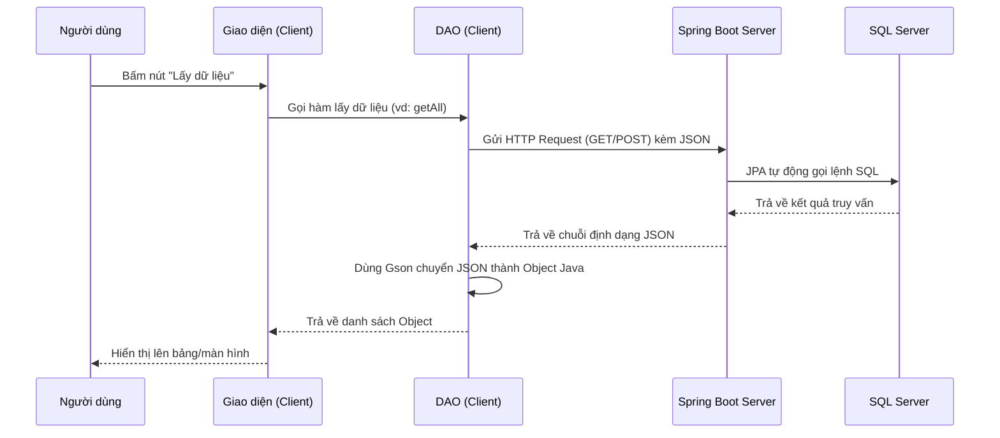

# TÀI LIỆU LỘ TRÌNH VÀ KIẾN TRÚC DỰ ÁN QUẢN LÝ HỌC SINH

Tài liệu này tổng hợp toàn bộ các bước chuyển đổi kiến trúc dự án từ mô hình cũ (Client gọi thẳng Database) sang mô hình mới chuẩn công nghiệp (Client ↔ Server ↔ Database) với tiêu chí **Clean Code** và dễ học nhất.

---

## 1. So sánh Kiến trúc Hệ thống

### ❌ Mô hình cũ (2 lớp)
- **Luồng đi:** Giao diện (Java Swing) ➜ Gọi lệnh SQL (JDBC) ➜ SQL Server.
- **Nhược điểm:** 
  - Kém bảo mật (lộ tài khoản SQL Server ngay trong code Client).
  - Khó bảo trì khi dự án lớn lên.
  - Phụ thuộc hoàn toàn vào ngôn ngữ Java.

### ✅ Mô hình mới (3 lớp)
- **Luồng đi:** Giao diện (Java Swing) ➜ Gửi HTTP/JSON ➜ **Spring Boot Server** ➜ Lệnh tự động (JPA) ➜ SQL Server.
- **Ưu điểm:**
  - **Bảo mật tuyệt đối:** Client không biết DB nằm ở đâu, mật khẩu DB là gì.
  - **Clean Code:** Chia nhỏ nhiệm vụ. Server chuyên xử lý Logic và Database; Client chuyên vẽ giao diện.
  - **Dễ mở rộng:** Sau này bạn có thể viết thêm Web, App Mobile kết nối chung vào Server này mà không phải code lại từ đầu.

---

## 2. Công nghệ và Thư viện đã sử dụng
- **Phía Server (Java Spring Boot):**
  - `spring-boot-starter-web`: Tạo các API (Endpoint) để Client gọi tới.
  - `spring-boot-starter-data-jpa`: Tự động hóa các câu lệnh SQL (Thêm/Sửa/Xóa).
  - `mssql-jdbc`: Driver kết nối SQL Server.
  - `Lombok (1.18.32)`: Tự động sinh code `get/set`, giúp code cực kỳ ngắn gọn.
- **Phía Client (Java Swing):**
  - `java.net.http.HttpClient`: Có sẵn từ Java 11, dùng để gửi request lên Server.
  - `Gson`: Thư viện của Google giúp biến chuỗi dữ liệu JSON từ Server về thành Object Java (ví dụ class `TaiKhoan`) chỉ bằng 1 dòng code.

---

## 3. Cấu trúc Thư mục Clean Code

```text
QLHS/
│
├── QuanLyHocSinh_Client/              # (Phần mềm Giao diện cho người dùng)
│   ├── pom.xml                        # Đã cài thêm Gson
│   └── src/main/java/
│       ├── View/                      # Màn hình giao diện (vd: LoginView)
│       ├── Controller/                # Điều khiển sự kiện nút bấm
│       ├── Model/                     # Class chứa dữ liệu (TaiKhoan, Diem,...)
│       ├── Dao/                       # (Cũ) Các file gọi Database trực tiếp bằng SQL
│       ├── Api/                       # (Mới) Nơi gửi HTTP Request lên Server (thay thế Dao)
│       └── TienIch/                   # Tiện ích chung
│
└── QuanLyHocSinh_Server/              # (Máy chủ xử lý ẩn)
    ├── pom.xml                        # Chứa cấu hình thư viện Spring Boot
    └── src/
        ├── main/
        │   ├── java/com/qlhs/server/
        │   │   ├── ServerApplication.java      # Nút khởi động Server (Chạy ở port 8080)
        │   │   │
        │   │   ├── entity/                     # Ánh xạ các bảng SQL (TaiKhoan, HocSinh...)
        │   │   ├── repository/                 # Nhúng JPA để gọi database ko cần viết SQL
        │   │   ├── service/                    # Xử lý Logic (Vd: Kiểm tra tk/mk hợp lệ)
        │   │   └── restControl/                # Tạo API tiếp đón Client (Vd: /api/taikhoan/login)
        │   │
        └── resources/
            └── application.yml        # Cấu hình kết nối SQL Server (Bảo mật tên DB, user, pass)
```

---

## 4. Các công việc đã hoàn thành

1. **Khởi tạo Server Spring Boot:** Thiết lập thành công kết nối tới cơ sở dữ liệu `QuanLyHocSinh` trong `application.yml`. Đặc biệt có xử lý chống đổi tên cột (`PhysicalNamingStrategy`) để tương thích 100% với database SQL Server hiện tại của bạn.
2. **Khắc phục lỗi biên dịch Lombok:** Cập nhật Lombok lên `1.18.32` để tương thích với các IDE cài đặt Java đời mới.
3. **Xây dựng API cho Tài Khoản:** 
   - Tạo bộ `Entity - Repo - Service - Controller` (Lưu trong thư mục `restControl`).
   - Tạo Endpoint: `POST http://localhost:8080/api/taikhoan/login`.
4. **Chuẩn bị sẵn Entity cho các tính năng khác:** Đã tạo trước cấu trúc cho phần **Điểm, Lịch Thi, Hạnh Kiểm**.
5. **Cập nhật Client & Refactor Kiến Trúc:** 
   - Đưa thư viện Gson vào `pom.xml`.
   - Di chuyển các tính năng đã nâng cấp (`TaiKhoan`, `Diem`, `LichThi`, `HanhKiem`) từ thư mục `Dao` sang thư mục mới tên là `Api`.
   - Đổi tên class từ `XxxDAO` thành `XxxApi` (Vd: `TaiKhoanApi.java`).
   - Viết lại hàm gửi request bằng `HttpClient` thay vì mò trực tiếp vào Database.

---

## 5. Hướng dẫn chạy dự án cho Thành Viên Mới

Để cả nhóm có thể chạy thử nghiệm dự án mượt mà, hãy tuân thủ các bước:

1. **Khởi chạy Server:** 
   - Dùng IntelliJ IDEA mở thư mục `QuanLyHocSinh_Server`.
   - Bấm nút **Reload All Maven Projects** để tải thư viện.
   - Nhấn Run file `ServerApplication.java`.
   - Cửa sổ log hiện `====== SERVER ĐANG CHẠY TRÊN PORT 8080 ======` là thành công.
2. **Khởi chạy Client:**
   - Mở thư mục `QuanLyHocSinh_Client`.
   - Nhấn Run file `LoginView.java` (hoặc file chạy chính của giao diện).
   - Nhập thông tin Đăng nhập (tài khoản này được kiểm tra thông qua Server).

---

## 6. Luồng hoạt động của hệ thống mới (Data Flow)

Để dễ tưởng tượng, hãy xem xét luồng đi của dữ liệu khi người dùng bấm nút lấy danh sách (hoặc đăng nhập):



---

## 7. Hướng dẫn chi tiết: Cách tự sửa/tạo tính năng mới cho nhóm

Nếu bạn hoặc các thành viên khác muốn tự tay chuyển đổi các chức năng (như Lớp Học, Môn Học, Giáo Viên) sang mô hình mới, hãy làm chuẩn theo quy trình 5 bước sau:

### PHÍA SERVER (Mở dự án `QuanLyHocSinh_Server`)

**Bước 1: Tạo Entity**
- Mở package `entity`.
- Tạo một Class mới (Ví dụ: `LopHoc.java`). Ánh xạ chính xác các cột trong Database bằng `@Column`.
- Thêm `@Id` vào thuộc tính khóa chính. 

**Bước 2: Tạo Repository**
- Mở package `repository`.
- Tạo một Interface kế thừa `JpaRepository<LopHoc, String>` (trong đó `String` là kiểu dữ liệu của khóa chính). Không cần viết code gì thêm.

**Bước 3: Tạo Service**
- Mở package `service`.
- Tạo class `LopHocService` (đánh dấu bằng `@Service`). Gọi hàm `findAll()`, `save()` của Repository ra. Nơi đây bạn sẽ viết các logic kiểm tra (ví dụ: tên lớp không được để trống).

**Bước 4: Tạo Controller (API Endpoint)**
- Mở package `restControl`.
- Tạo class `LopHocController` (đánh dấu bằng `@RestController` và `@RequestMapping("/api/lophoc")`).
- Tạo các hàm `@GetMapping` (để lấy dữ liệu), `@PostMapping` (để Thêm/Sửa), `@DeleteMapping` (để Xóa).

---

### PHÍA CLIENT (Mở dự án `QuanLyHocSinh_Client`)

**Bước 5: Chuyển đổi DAO thành Api**
- Mở file DAO cũ (Ví dụ: `LopDAO.java`) và chuyển nó sang thư mục `Api`. 
- Đổi tên file thành `LopApi.java` (để mọi người biết nó xài API mới).
- Thay vì gọi `ConnectDB.getConnection()`, bạn hãy đổi code thành:
1. Dùng `HttpRequest` và `HttpClient` (có sẵn của Java) gọi vào đường dẫn `http://localhost:8080/api/lophoc`.
2. Dùng thư viện `Gson` biến đổi kết quả trả về:
   ```java
   // Code mẫu biến JSON từ Server thành List Objects:
   Gson gson = new Gson();
   Type listType = new TypeToken<ArrayList<LopHoc>>(){}.getType();
   List<LopHoc> danhSach = gson.fromJson(response.body(), listType);
   return danhSach;
   ```
3. Sau khi file DAO đã chạy mượt, bạn có thể hoàn toàn quên lớp CSDL đi và chỉ quan tâm tới API!

*Chúc nhóm bạn hoàn thiện dự án một cách xuất sắc!*
