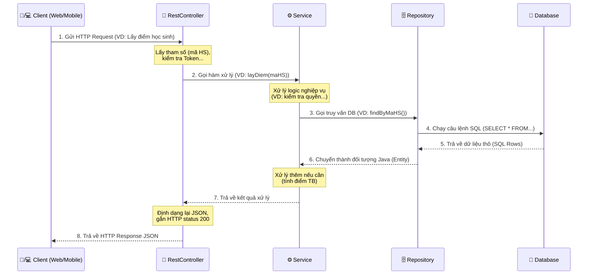

# Báo Cáo Kiến Trúc & Luồng Hoạt Động Của Server (Spring Boot)

Báo cáo này giúp các thành viên trong nhóm hiểu rõ cách thức hoạt động, vai trò của từng thành phần (module/package) và luồng dữ liệu (data flow) đi qua các thành phần đó trong dự án Backend Spring Boot của chúng ta.

Dự án hiện tại đang áp dụng mô hình kiến trúc phổ biến nhất trong Spring Boot là **Layered Architecture** (Kiến trúc phân tầng) bao gồm 4 phần chính: `entity`, `repository`, `service` và `restControl`.

---

## 1. Tổng Quan Về Các Thành Phần (Packages)

Mỗi thư mục trong mã nguồn tương ứng với một "tầng" đảm nhiệm một vai trò duy nhất (Separation of Concerns). Điều này giúp code dễ đọc, dễ sửa và chia việc trong team dễ dàng hơn.

### 📦 `entity` (Tầng Thực Thể / Dữ Liệu)
- **Vai trò:** Chứa các class đại diện cho các bảng trong cơ sở dữ liệu (Database).
- **Hoạt động:** Sử dụng các annotation của JPA/Hibernate (như `@Entity`, `@Table`, `@Id`, `@Column`...) để ánh xạ một class Java (ví dụ: `Diem.java`) thành một bảng trong SQL.
- **Quy tắc:** Chỉ chứa định nghĩa cấu trúc dữ liệu, quan hệ giữa các bảng (như `@OneToMany`, `@ManyToOne`), tuyệt đối **không** chứa logic xử lý nghiệp vụ ở đây.

### 📦 `repository` (Tầng Truy Xuất Dữ Liệu - Data Access)
- **Vai trò:** Là nơi duy nhất giao tiếp trực tiếp với Database.
- **Hoạt động:** Các interface ở đây thường kế thừa (extend) từ `JpaRepository`. Spring Boot sẽ tự động tạo sẵn các hàm cơ bản (CRUD) như `save()`, `findById()`, `findAll()`, `delete()` mà không cần viết lệnh SQL.
- **Ví dụ:** Nếu cần một truy vấn phức tạp hơn (ví dụ: Tìm điểm theo mã học sinh), ta chỉ cần khai báo tên hàm theo quy tắc hoặc dùng `@Query` viết câu lệnh SQL ở đây.

### 📦 `service` (Tầng Xử Lý Nghiệp Vụ - Business Logic)
- **Vai trò:** Đây là **"bộ não"** của hệ thống, nơi chứa toàn bộ logic tính toán, kiểm tra dữ liệu và quy trình nghiệp vụ.
- **Hoạt động:** 
  - Tầng Service sẽ gọi các hàm từ tầng `repository` để lấy/lưu dữ liệu.
  - Xử lý dữ liệu đó (ví dụ: Tính điểm trung bình, kiểm tra xem học sinh có được phép thi hay không, mã hóa mật khẩu...).
- **Tại sao cần tầng Service mà không viết luôn logic trong Controller?** 
  - Nếu bạn có chức năng "Lưu Điểm", chức năng này có thể được gọi từ RestController (khi Admin nhập điểm) hoặc được gọi tự động từ một tiến trình chạy ngầm nào đó. Việc tách ra Service giúp **tái sử dụng lại logic** mà không cần viết lại. Giúp Controller gọn gàng hơn.

### 📦 `restControl` (Tầng Giao Tiếp - API Controller)
- **Vai trò:** Là "cánh cửa" giao tiếp với bên ngoài (Ví dụ: Web Frontend, Mobile App Android/iOS).
- **Hoạt động:**
  - Nhận các HTTP Request (như `GET`, `POST`, `PUT`, `DELETE`) từ Client.
  - Lấy các tham số (parameters) từ URL hoặc Body.
  - **Gọi tới tầng `service`** để thực hiện công việc.
  - Trả về kết quả cho Client dưới định dạng `JSON` thông qua các HTTP Response (Kèm theo Status Code: 200 OK, 400 Bad Request, 500 Server Error...).

---

## 2. Luồng Hoạt Động Của Một Request (Data Flow)

Dưới đây là sơ đồ mô tả cách dữ liệu đi từ khi Client gửi yêu cầu cho đến khi nhận được kết quả.

### Ví Dụ Thực Tế: Thêm Điểm Mới
Giả sử người dùng bấm nút "Lưu Điểm" trên ứng dụng:
1. **Client** gửi một HTTP `POST /api/diem` kèm theo dữ liệu JSON (Điểm Toán: 9, Mã HS: 123).
2. **`DiemController`** nhận Request này, chuyển chuỗi JSON thành đối tượng Java. Sau đó gọi `diemService.themDiemMoi(...)`.
3. **`DiemService`** kiểm tra xem mã HS 123 có tồn tại không? Nếu điểm > 10 thì báo lỗi. Nếu dữ liệu hợp lệ, gọi `diemRepository.save(...)`.
4. **`DiemRepository`** nhận lệnh, gọi Hibernate tự động tạo câu lệnh `INSERT INTO diem...` và lưu xuống **Database**.
5. Sau khi lưu thành công, kết quả chạy ngược lại từ DB -> Repository -> Service -> Controller. Cuối cùng Controller trả về `{ "status": "success", "message": "Thêm điểm thành công" }` cho Client.

---

## 3. Tóm Lược 3 Nguyên Tắc Cốt Lõi (Dành Cho Cả Team)

Để dự án không bị rối rắm khi code phình to, team cần tuân thủ các nguyên tắc sau:

1. **Controller chỉ lo giao tiếp, không chứa logic:** Controller chỉ nhận request, bắt lỗi định dạng tham số, gọi Service và trả về kết quả. Tuyệt đối không viết logic tính toán/kiểm tra rườm rà ở đây.
2. **Repository chỉ thao tác DB:** Không viết logic tính toán ở Repository. Chỉ định nghĩa các hàm Query.
3. **Mọi xử lý nghiệp vụ phải đặt trong Service:** Service là nơi giải quyết bài toán của ứng dụng. Service chỉ giao tiếp với Repository và các Service khác (nếu cần), tuyệt đối Service không được chứa các object của HTTP như `HttpServletRequest` hay trả về `ResponseEntity` (những thứ này là việc của Controller).

Mong rằng báo cáo này sẽ giúp team nắm được bức tranh tổng thể và quy định viết code của dự án một cách rõ ràng nhất!
